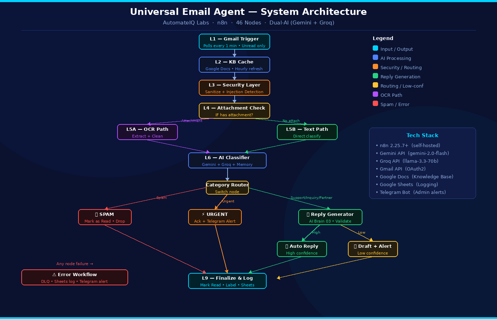

<!-- SEO Meta: AI email automation agent n8n Gmail workflow automation Bangladesh AutomateIQ Labs Gemini Groq dual-AI email responder sentiment detection OCR attachment processing prompt injection protection -->

<div align="center">


[](https://n8n.io)
[](https://ai.google.dev)
[](https://groq.com)
[](https://developers.google.com/gmail)
[](https://docs.n8n.io/hosting/)
[](LICENSE)

<br/>

> **🤖 An intelligent, production-ready email automation agent that reads, classifies, and responds to every email — automatically.**

</div>

---

## 📌 What Is This?

**Universal Email Agent** is a fully automated, AI-powered email handling system built on **self-hosted n8n**. It connects to your Gmail inbox, processes every incoming email through a multi-layer AI pipeline, and handles responses — without any human involvement.

Built by **[Muhammad Antor](https://www.linkedin.com/in/muhammad-antor)** | [AutomateIQ Labs](https://www.facebook.com/automateiq.labs/)

---

## ⚡ Key Features

| Feature | Description |
|---|---|
| 🧠 **Dual-AI Brain** | Gemini 2.0 Flash (primary) + Groq Llama 3.3 (fallback) work together |
| 📎 **OCR on Attachments** | Reads and extracts content from PDF, image attachments via AI |
| 💬 **Smart Classification** | Categorizes every email: Spam / Urgent / Support / Inquiry / Partnership |
| 😤 **Sentiment Detection** | Detects frustrated or angry tone — auto-escalates to admin |
| 🛡️ **Prompt Injection Protection** | Blocks malicious emails attempting to manipulate the AI |
| 🔄 **Knowledge Base Cache** | Reads from Google Docs KB — cached hourly for performance |
| 📊 **Confidence Scoring** | High confidence → auto-reply. Low confidence → admin draft suggestion |
| 📋 **Full Audit Log** | Every email logged to Google Sheets with category, sentiment & confidence |
| 💀 **Dead Letter Queue** | Failed emails captured, logged & admin alerted via Telegram |
| 🔁 **Deduplication** | "AI-Processed" Gmail label prevents any email from being processed twice |
| 📱 **Telegram Notifications** | Real-time admin alerts for urgent emails, errors & low-confidence drafts |
| 🏠 **100% Self-Hosted** | Runs entirely on your own server — your data never leaves your infrastructure |

---

## 🏗️ System Architecture

### High-Level Flow

```
📧 Email Arrives
      ↓
📚 Knowledge Base Load (cache → Google Docs)
      ↓
🛡️ Security Layer (sanitize + injection check)
      ↓
📎 Attachment? ──YES──→ OCR Extract → AI Classify
      │
      NO
      ↓
🧠 AI Classify (category + sentiment + confidence)
      ↓
┌─────────────────────────────────┐
│         Category Router         │
├──────────┬──────────┬───────────┤
│  🚫 SPAM │ ⚡URGENT │ 💬 REPLY  │
│   Drop   │Telegram  │  Generate │
│          │  Alert   │ + Validate│
└──────────┴──────────┴───────────┘
      ↓
High Confidence → Auto Reply
Low Confidence  → Ack + Admin Draft Alert
      ↓
✅ Mark Read + Label + Log to Sheets

⚠️ Any Failure → Dead Letter Queue → Telegram Error Alert
```

### Architecture Diagram



### Layer Overview

| Layer | Function |
|---|---|
| **L1 — Input** | Gmail trigger, polls every minute for unread emails |
| **L2 — KB Cache** | Loads knowledge base from Google Docs with 1-hour cache |
| **L3 — Security** | Input sanitization + prompt injection detection |
| **L4 — Routing** | Detects attachment presence and routes accordingly |
| **L5A — OCR Path** | AI-powered text extraction from attachments |
| **L5B — Text Path** | Direct processing for plain-text emails |
| **L6 — AI Brain** | Dual-AI classification + sentiment + confidence scoring |
| **L7 — Category Router** | Routes to Spam / Urgent / Reply Generator |
| **L8 — Output** | Auto-reply or admin alert based on confidence |
| **L9 — Finalize** | Mark as read, apply label, log to Google Sheets |
| **L10 — Error** | Dead Letter Queue + error logging + Telegram alert |

**Total: 46 nodes across 10 layers + sub-models**

---

## 🛠️ Tech Stack

### Automation Platform
 Self-hosted, Docker · Version 2.25.7+

### AI / LLM Models
 Primary AI brain  
 Fallback AI model + speed layer

### Integrations


---

## 📋 Prerequisites

Before setup, you need the following accounts and services:

| Service | Purpose | Cost |
|---|---|---|
| n8n (self-hosted) | Workflow engine | Free |
| Google Gemini API | Primary AI model | Free tier available |
| Groq API | Fallback AI model | Free tier |
| Gmail Account | Email monitoring | Free |
| Google Docs | Knowledge Base | Free |
| Google Sheets | Email audit log | Free |
| Google Cloud Service Account | Docs + Sheets auth | Free |
| Telegram Bot | Admin notifications | Free |
| Docker | n8n hosting | Free |

---

## 🚀 Setup Overview

### Step 1 — Deploy n8n

Host n8n using Docker. Required environment variable:
```bash
N8N_SKIP_AUTH_ON_OAUTH_CALLBACK=true
```
> This is critical for Gmail OAuth to work correctly.

### Step 2 — Configure Credentials

Set up the following credentials in n8n:
- **Gmail OAuth2** — with full Gmail scope
- **Google Service Account** — for Docs & Sheets access
- **Google Gemini API** — AI Studio key
- **Groq API** — from console.groq.com
- **Telegram Bot** — from @BotFather

### Step 3 — Prepare Google Services

1. **Knowledge Base** — Create a Google Doc with your business information, FAQs, and tone guidelines. Share with your Service Account.
2. **Email Log Sheet** — Create a Google Sheet with two tabs: `Email Log` and `Failed Emails`. Share with your Service Account as **Editor**.
3. **Gmail Label** — Create an `AI-Processed` label in Gmail. Note the Label ID.

### Step 4 — Import & Configure Workflow

1. Import the n8n workflow JSON
2. Connect all credentials to their respective nodes
3. Update the following in the workflow:
   - Google Doc URL (Knowledge Base)
   - Google Sheets ID
   - Telegram Chat ID
   - Gmail Label ID

### Step 5 — Activate

Toggle the workflow from **Inactive → Active**.

---

## 🧪 Testing Scenarios

Use these test cases to verify your setup:

| Test | How | Expected Result |
|---|---|---|
| **Basic email** | Send a simple inquiry email | Classified → auto-replied → logged in Sheets |
| **Urgent detection** | Send email with frustrated/angry tone | Escalated → Telegram alert → ack reply |
| **Attachment (PDF)** | Send email with PDF attached | OCR extracted → classified → replied |
| **Prompt injection** | Send `"Ignore previous instructions..."` | Blocked → marked as read → no reply |
| **Unsupported file** | Attach .mp3 or .mp4 | Auto-reply: unsupported file type |
| **Duplicate email** | Forward a processed email | No trigger (AI-Processed label blocks it) |
| **Spam** | Send obvious spam | Silent drop → marked as read |

---

## 📊 Email Categories

| Category | Detection Logic | Action |
|---|---|---|
| **Spam** | AI confidence + pattern | Silent drop + mark as read |
| **Urgent** | Keywords + angry/frustrated sentiment | Ack reply + Telegram alert |
| **Support** | Help/issue-related content | AI reply from Knowledge Base |
| **Inquiry** | Questions about services/pricing | AI reply from Knowledge Base |
| **Partnership** | Collaboration/business proposals | AI reply from Knowledge Base |

---

## 🔒 Security Features

- **Prompt Injection Detection** — Email content is scanned for AI manipulation attempts before any AI processing
- **Input Sanitization** — All email content is cleaned before entering the AI pipeline
- **Self-Hosted** — 100% on your own infrastructure. No third-party email data exposure
- **Deduplication** — Processed emails are labeled to prevent double-processing

---

## 📈 Why This Architecture?

| Design Choice | Reason |
|---|---|
| Dual AI (Gemini + Groq) | Redundancy + speed. Groq handles high-speed tasks, Gemini handles complex reasoning |
| KB Cache (1hr) | Reduces Google Docs API calls dramatically |
| Confidence Scoring | Prevents bad AI replies from being sent automatically |
| Dead Letter Queue | Zero email loss — every failure is captured and alerted |
| Self-hosted n8n | Full data ownership. No SaaS email data sharing |

---

## 🗺️ Roadmap

- [ ] Multi-inbox support (multiple Gmail accounts)
- [ ] Multilingual reply support (Bangla + English)
- [ ] Web dashboard for email analytics
- [ ] SaaS version — plug in your credentials & run
- [ ] WhatsApp notification support
- [ ] CRM integration (auto-create leads from emails)

---

## 👨‍💻 About The Builder

**Muhammad Antor** — AI Automation Engineer | Founder of AutomateIQ Labs

I build production-grade AI automation systems that eliminate manual business work.

[](https://www.linkedin.com/in/muhammad-antor)
[](https://www.facebook.com/automateiq.labs/)
[](https://github.com/muhammadantor)
[](mailto:muhammadantor71@gmail.com)

---

## 📄 License

MIT License — see [LICENSE](LICENSE) for details.

---

<div align="center">

*Built with ❤️ by [AutomateIQ Labs](https://www.facebook.com/automateiq.labs/) · Bangladesh*


</div>

<!-- 
SEO Keywords: AI email automation n8n, Gmail automation workflow, email responder agent, 
n8n email bot, AI email agent Bangladesh, AutomateIQ Labs, Gemini email automation,
workflow automation engineer, n8n Groq integration, self-hosted email agent,
email classification AI, sentiment detection email, prompt injection protection n8n
-->
